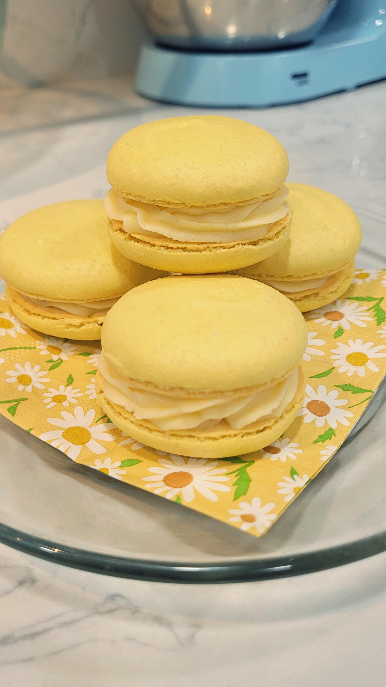
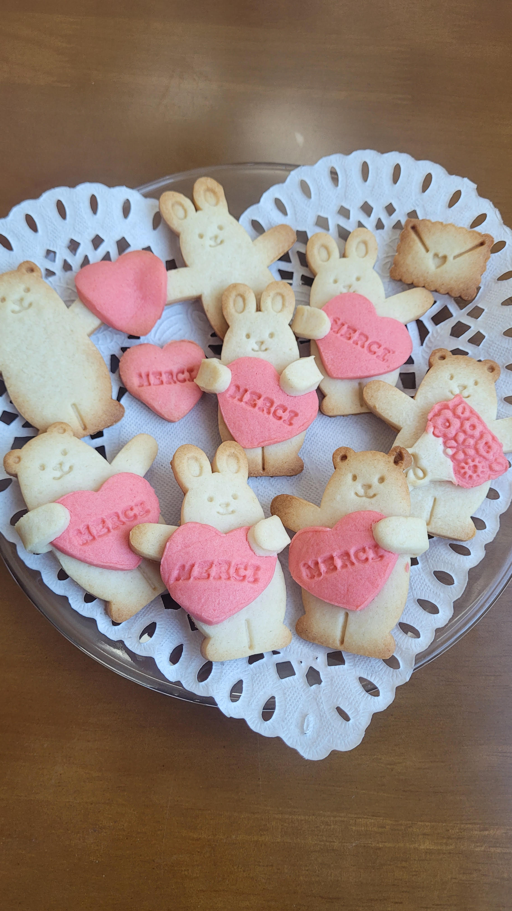
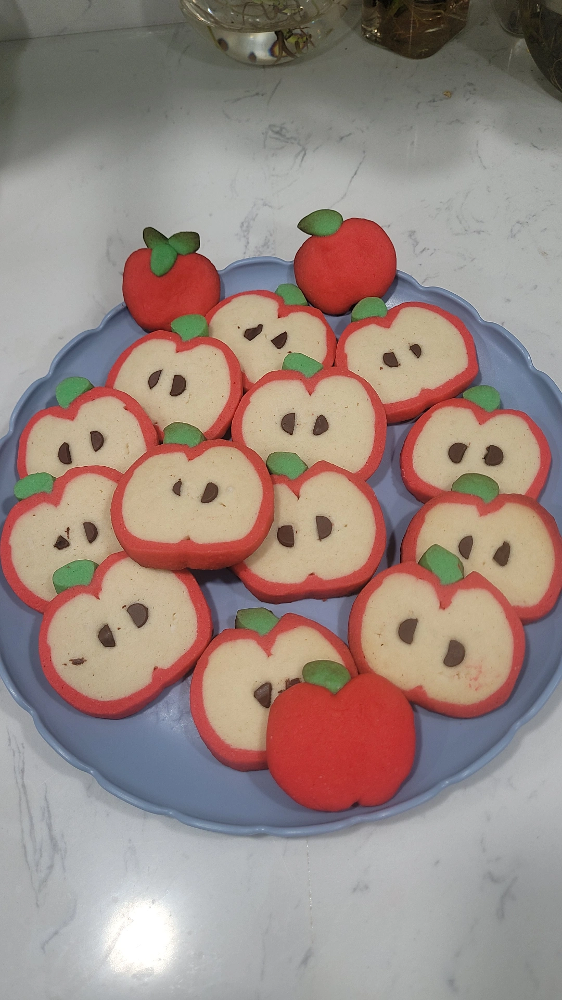
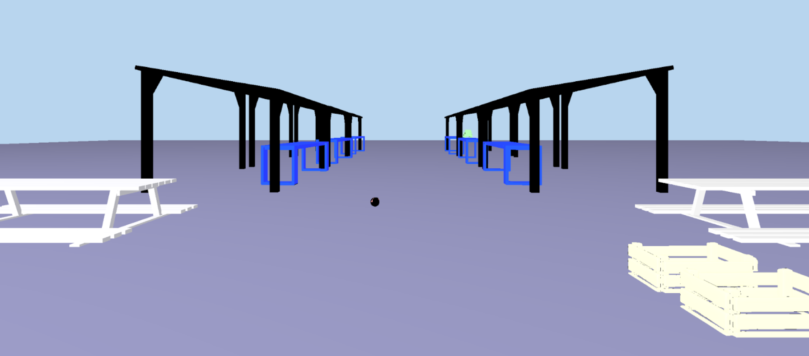
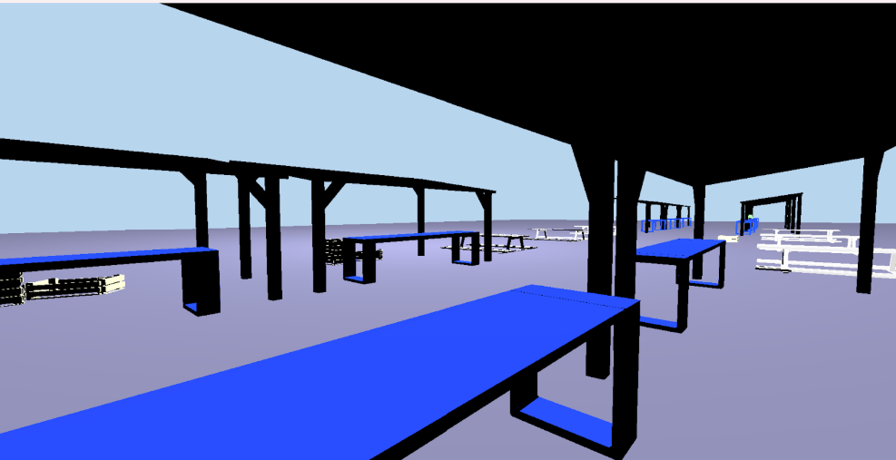

# CSC 317 Assignment 2 Submission

**Name:** Aketzali Zeledon
**Student ID:** 917079584
**GitHub Username:** AketzaliZ
**Assignment Number:** 2  


##  HTML Personal Portfolio Website Assignment

### Description:
The following is a simple portfolio demonstating the use of different HTML skills. Using HTML syntax, simple styling, and taking advantage of semantic elements of HTML to properly organize the page from a programming standpoint.


## Approach / What I Did:
I chose to divide my portfolio into different parts, header, education, projects, baking, and footer.
The header included any immediate intro information and is proceeded by a navigation menu to jump to the mention sections.


## Code Explanation:
I used html tables to organize sections of data and information. For example, the names of desserts followed by their pictures in a table format allowing for potential future sections of data to be added.

```html
<h2>Baking</h2>
    <table>
        <tr>
           <td>Lemon Macarons</td>
                <td></td>
        </tr>
        <tr>
            <td>Shortbread Cookies</td>
            <td></td>
        </tr>
        <tr>
            <td>Apple Cookies</td>
            <td></td>
        </tr>
    </table>
```
For the Projects section, I decided to utilize the semantic element of article because the content of each project was different. 

```html
<article>
    <h3>Flea Market 3D Render</h3>
    
    
    <p> A program, which reads-in and renders an indexed face set meshes to an image via
        software rasterization.The Scene is ment to convey an empty outdoor market with
        stalls and picnic tables. When making this project I was thinking about the
        San Jose Flea Market. It has been a staple of the Latino Community and now the
        property owners are trying to sell the land, forcing many vendors to find other
        work resulting in the community losing another influencial cultural hub.
    </p>
</article>
```
One of the most user friendly aspects i integrated was the navigation portion that allowed users
to quickly jump to specific parts of the page. I also decided to have an option to jump back to the header from the bottom of the page.

```html
<nav>
    <ul>
        <li><a href="#school">Education</a></li>
        <li><a href="#jobs">Experience</a></li>
        <li><a href="#skills">Projects</a></li>
        <li><a href="#hobbies">Leisure: Baking</a></li>
        <li><a href="#contact">Contact</a></li>
     </ul>  
</nav>
```
...

```html
<a href="#home" ><p style="padding: 5%;"> ^ Back to Top ^</p></a>
